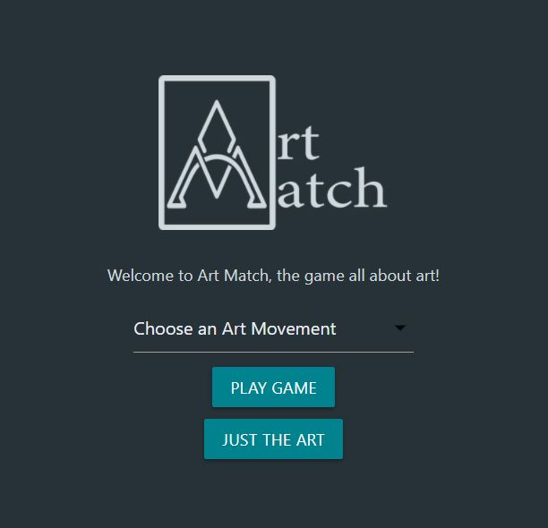

## Project title
ArtMatch

## Description
Art Memory is an app that will let a user browse through artistic pieces and play a memory card game with the art. This is a solo React project.

## Screenshots

## Tech/framework used
- [React](https://reactjs.org/)
- [HTML5](https://developer.mozilla.org/en-US/docs/Web/Guide/HTML/HTML5)
- [CSS3](https://developer.mozilla.org/en-US/docs/Archive/CSS3)
- [Javascript ES6](https://www.javascript.com/)

<b>Built with</b>
- [Materialize](https://materializecss.com/)

## API Reference
<a href="https://metmuseum.github.io/">The Met API</a>

## Credits
-<a href="https://github.com/TaitLoughridge">Tait Loughridge</a>

